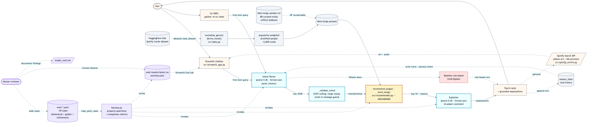

# SoundFit — Conversational Music Recommender

A local-first agentic music recommender. Type what you're in the mood for; a
local `qwen2.5:3b` agent (via Ollama) extracts musical intent from natural
language, a deterministic feature scorer ranks ~5,000 real Spotify tracks
sourced from a public HuggingFace dataset, and the agent writes grounded
explanations citing concrete features. Multi-turn refinement, no API keys
required, no songs ever invented.



## What this project is

This started as a simple weighted-feature scorer over a 10-song catalog
(SoundFit 1.0, see [model_card.md](model_card.md)). It became a
portfolio-grade demonstration of:

- **Real agentic pattern, not a chat wrapper** — structured intent extraction,
  scorer-as-tool, grounded explanation, multi-turn refinement, chat memory
- **Production-flavored engineering** — Docker-ready, healthchecks, env
  configuration, graceful Ollama-down fallback, deterministic seeds
- **Measurable, not vibes-based** — property-based eval harness with metrics
  CSV (intent accuracy, hallucination rate, agent-vs-baseline overlap,
  refinement consistency, explanation grounding)
- **Local-first, runnable anywhere** — `qwen2.5:3b` via Ollama; one env var
  flips it to a remote Ollama host if your local RAM is tight
- **Visible reasoning** — the Streamlit UI shows parsed intent JSON,
  candidate scores, and live eval metrics side-by-side with the chat

The original rule-based scoring code in [src/recommender.py](src/recommender.py)
is **untouched** — it stays as the deterministic ranking layer. The agent
adds an *understanding* layer (intent extraction) and an *explanation*
layer on top.

## Quickstart

### 1) Start Ollama and pull the model

```bash
# macOS / Linux
brew install ollama        # or download from ollama.com
ollama serve &             # background daemon
ollama pull qwen2.5:3b     # ~2GB, one-time
```

### 2) Install dependencies

```bash
python3 -m venv .venv
source .venv/bin/activate
pip install -r requirements.txt
```

### 3) Run the chat UI

```bash
streamlit run src/streamlit_app.py
# → opens http://localhost:8501
```

Or use the CLI REPL:

```bash
python -m src.main             # interactive chat with the agent
python -m src.main --baseline  # rule-based REPL, no LLM
python -m src.main --demo      # legacy 4-profile baseline demo
```

### 4) (Optional) Spotify enrichment for album art + 30s previews

Get a `SPOTIFY_CLIENT_ID` and `SPOTIFY_CLIENT_SECRET` from
[developer.spotify.com](https://developer.spotify.com/dashboard), then:

```bash
cp .env.example .env
# edit .env to fill them in
```

Without these the app runs perfectly fine — you just don't get cover images.
The deprecated audio-features endpoint is **not** used; audio data comes from
the HuggingFace catalog.

## Try these

| Query | What the agent does |
|---|---|
| `aux rap songs` | Slang → `genre=hip-hop, mood=intense, energy~0.85` |
| `late night coding music` | `mood=focused, energy<0.4, acousticness~0.7` |
| `songs by Drake` | Catalog filter by artist; falls back to similar-style picks if missing |
| `more upbeat though` | Refinement: same genre, higher energy |
| `polka music` | OOV genre → null'd at validator, agent degrades gracefully |
| `heartbreak playlist` | `valence<0.3, mood=moody/relaxed` |

Type `reset` (or `clear`) in the CLI to wipe chat history mid-session.

## Architecture

Per-turn pipeline:

1. **Intent extraction** — `qwen2.5:3b` with `format=json`. Validated by a
   Pydantic schema; OOV genres/moods are nulled, numerics coerced and
   clamped, and `artist` is dropped if its name doesn't appear in the
   *current* user message (a hard rule that stops the LLM from leaking
   artists across turns).
2. **Scoring (deterministic tool)** — `recommend_songs()` in
   [src/recommender.py](src/recommender.py), unchanged. The LLM never reorders.
3. **Grounded explanation** — `qwen2.5:3b` writes one short sentence per
   candidate, restricted to the IDs it was given. If it tries to invent an
   ID we drop the LLM output and use the deterministic reason strings.
4. **Memory & refinement** — chat history kept in `st.session_state`. When
   the LLM detects a refinement (`more upbeat`, `less intense`,
   `show different ones`), feature fields are merged with the prior turn's
   intent. Artist is *not* carried over — it's a fresh switch each turn.

See [assets/architecture.mmd](assets/architecture.mmd) for the editable
Mermaid source.

## Catalog

~5,000 real tracks sampled from the public HuggingFace dataset
[`maharshipandya/spotify-tracks-dataset`](https://huggingface.co/datasets/maharshipandya/spotify-tracks-dataset).
The original Spotify audio features (energy, valence, danceability,
acousticness, tempo) are preserved. Sampling is **popularity-weighted**
(quadratic) so household-name artists land in the working set instead of
getting cut by uniform random.

Spotify deprecated public access to the `/audio-features`,
`/recommendations`, and `/related-artists` endpoints for new apps in
November 2024. We work around this by sourcing audio features from the
HuggingFace dataset; the still-working `/search` endpoint is used only
(optionally) for album art and preview audio.

The agent's scorer can't use a `mood` field straight from Spotify (it
doesn't exist), so we derive it deterministically from
`(valence, energy, acousticness, instrumentalness)` — see
[`derive_mood`](src/data.py) and the [model card](model_card.md).

If HuggingFace is unreachable, the app falls back to
[data/songs_sample.csv](data/songs_sample.csv) — 88 hand-curated tracks
committed to the repo. Tests use this sample so they run offline.

## Evaluation

Property-based YAML cases live in [eval/](eval). Run the live harness with:

```bash
pytest --ollama -v   # ~5 min on CPU
```

The latest run wrote `eval/results/summary.json`:

```json
{
  "total_cases": 30,
  "passed": 30,
  "pass_rate": 1.0,
  "hallucinated_id_count": 0,
  "by_type": {
    "behavioral": { "passed": 12, "total": 12, "rate": 1.0 },
    "golden":     { "passed": 12, "total": 12, "rate": 1.0 },
    "refinement": { "passed":  6, "total":  6, "rate": 1.0 }
  }
}
```

Hard guarantees (the harness fails if violated):

- The agent **never** returns a song ID that isn't in the catalog
- Behavioral pass rate floor: 70%
- Golden pass rate floor: 60%
- Refinement pass rate floor: 50%

Cases come in three flavors:

- **Behavioral** — assert what the intent parser extracts in isolation
  (genre, mood, artist). Includes adversarial cases ("polka music" must
  return `genre=null`, not a hallucinated similar genre).
- **Golden** — end-to-end. Free-text query → property assertions on top-K
  features (e.g. "upbeat workout music" → `top1_energy >= 0.7`).
- **Refinement** — multi-turn. "chill electronic" → "more upbeat though"
  must shift average energy upward by at least +0.10.

Open `eval/results/latest.csv` (regenerated each run) for per-case detail
or use the Streamlit Eval tab.

## Repository layout

```
src/
  agent.py           # Ollama pipeline, parse_intent, explain, run_agent
  schemas.py         # Pydantic IntentSchema, RecommendationCard, AgentTurn
  data.py            # HF Hub loader, mood derivation, genre normalization
  recommender.py     # Original rule-based scorer (UNCHANGED)
  spotify_enrich.py  # Optional album art / preview enrichment
  streamlit_app.py   # Chatbox UI with Trace + Eval tabs
  main.py            # CLI: REPL chat + --demo + --baseline
data/
  songs.csv          # Original 10-track legacy catalog
  songs_sample.csv   # 88-track offline fallback (committed)
  songs.parquet      # ~5k working catalog (gitignored, regenerated)
eval/
  golden_cases.yaml          # 12 end-to-end cases
  behavioral_cases.yaml      # 12 intent-parser cases
  refinement_cases.yaml      #  3 multi-turn cases
  harness.py                 # loaders + assertions + runners + writer
  results/                   # CSVs + summary.json (gitignored)
tests/                       # 63 unit tests + 14 eval-harness tests
assets/
  architecture.mmd           # Mermaid source
  architecture.png           # Rendered diagram (committed)
```

## Limitations

- **3B model is small.** `qwen2.5:3b` works well for the slang dictionary in
  the system prompt but isn't going to handle very subtle queries the way
  a 70B model would. The agent's hard validator catches its mistakes
  (OOV nulling, artist-leak prevention, ID-subset constraint) but the
  intent quality is still bounded by the model.
- **Catalog is ~5k tracks.** Famous-but-niche artists (some users' favorites)
  may not be in the sample even with popularity weighting. The agent
  handles this gracefully (similar-style fallback, surfaced as a note),
  but it's not a music streaming service.
- **No LLM-as-judge in the eval harness.** qwen2.5:3b judging its own
  output is circular at this parameter count. Property-based assertions
  + grounding regex are reproducible and clearer.
- **First Streamlit interaction is slow** (~10s) because Ollama warms up
  the model on the first call. Subsequent calls are 2–5s on CPU.

See [model_card.md](model_card.md) for full strengths/limitations,
evaluation methodology, and reflection.
